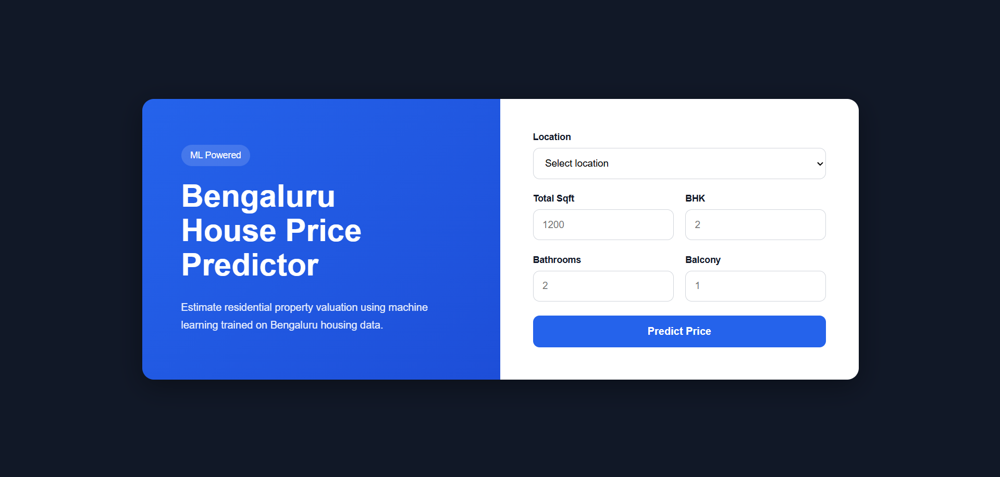

<div align="center">

# 🏠 Bengaluru House Price Predictor
**Estimate residential property prices in Bengaluru using Machine Learning**

[](https://bengaluru-house-price-prediction-f976.onrender.com)
[](https://python.org)
[](https://flask.palletsprojects.com)
[](https://scikit-learn.org)



</div>

---

## 🧠 How It Works

1. **Data Cleaning** — Range-based sqft values (e.g. `1000-1200`) are averaged; rows with nulls are dropped.
2. **Outlier Removal** — Cross-BHK logic: a higher BHK listing priced more than 1 std dev below the lower BHK tier's mean in the same location is flagged and removed.
3. **Location Filtering** — Locations with fewer than 10 listings are dropped to avoid noise.
4. **Model Selection** — Linear Regression, Ridge, and Random Forest evaluated using 5-fold cross-validation. Random Forest gave the best mean R².
5. **Training** — Final RF model trained on the full cleaned dataset and exported via pickle.
6. **Serving** — Flask backend loads the model, populates the location dropdown from the dataset, validates inputs, and returns predictions.

---

## 🛠️ Tech Stack

| Layer | Technology |
|---|---|
| ML Model | Random Forest Regressor (scikit-learn) |
| Preprocessing | pandas, NumPy, OneHotEncoder inside sklearn Pipeline |
| Backend | Flask |
| Frontend | HTML, CSS, Vanilla JS |
| Model Export | pickle |

---

## 📁 Project Structure

```
├── main.py                        # Flask app — routes & prediction logic
├── house_price_predicting.ipynb   # Preprocessing, model selection, training
├── Bengaluru_House_Data.csv       # Dataset (included)
├── House_Predicting_Model.pickle  # Trained model (included)
├── templates/
│   └── index.html                 # Frontend UI
├── static/
│   ├── style.css
│   └── script.js
├── assets/
│   └── Screenshot.png
├── requirements.txt
└── .gitignore
```

---

## ⚙️ Run Locally

> **Requires Python 3.10.8**

**1. Clone the repo**
```bash
git clone https://github.com/Gyan-Ranjan-01/bengaluru_house_price_prediction
cd bengaluru-house-price-prediction
```

**2. (Optional) Create a virtual environment**
```bash
python -m venv .venv
# Windows
.venv\Scripts\activate
# macOS/Linux
source .venv/bin/activate
```

**3. Install dependencies**
```bash
pip install -r requirements.txt
```

**4. Start the app**
```bash
python main.py
```

Open `http://localhost:5000` in your browser.

> The dataset (`Bengaluru_House_Data.csv`) and trained model (`House_Predicting_Model.pickle`) are included in the repo — no manual download or notebook run required to get the app running.  
> Re-run `house_price_predicting.ipynb` only if you want to retrain the model from scratch.

---

## ✅ Input Validation

The backend rejects physically implausible inputs before hitting the model:

- `total_sqft` below minimum threshold
- Bathroom count exceeding BHK + 2

---

<div align="center">

**Gyan Ranjan**

[](https://www.linkedin.com/in/gyan-ranjan-/)

IT Student · IIEST Shibpur

</div>